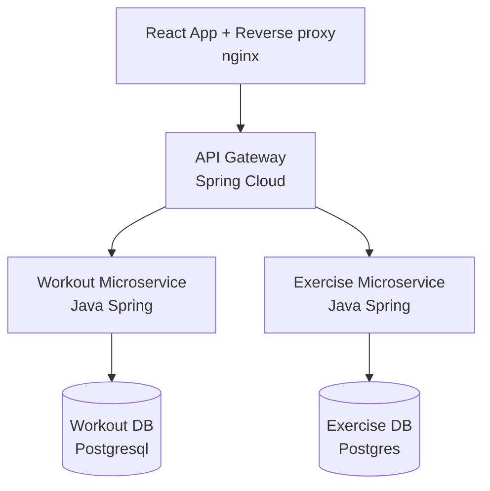

# Simple Workout application
***

This repo consists code for Simple Workout Web Application. It is a part of 
my ISA (Internet Service Architecture) Course.

The backend part of the app is build with Java Spring framework.


## Service Architecture


## Running it localy
The application is containerized using **Docker**. 
Here is instruction how to run it:

1. Create your ```.env``` file using prepared example ```.env.
example```
2. Run docker composition
```bash
docker compose up
```
3. Open http://localhost:8080 in the browser to view the app
